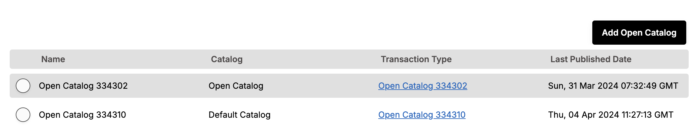

# Open Catalog addon

- The Open Catalog Add-on allows you to publish a catalog of your Pepperi products to a web page with no user registration required.

## Overview

- The data and configuration for the catalog are exported from Pepperi and published to a high-speed database that allows for super-fast search and filtering. 
- Pepperi provides an API for web site developers to access this database and display the information on their web site, as well as a WordPress Plugin that automatically publishes the catalog on their web site.

---

## Data Model

- The catalogs data and configuration  stores in 4 ADAL tables:
    - **OpenCatalogSettings**: for list of open catalogs.
    - **OpenCatalogSecret**: for each open catalog we keep the published version and secret key.
    - **OpenCatalogData**: keep the history of each publish catalog.
    - **OpenCatalogScheduleJob**: Keep the catalog settings.

- Then PNS (pepperi notification service) subscribe to adal changes cause when a new version of open catalog is installed we need to delete the old index from elastic. (installation.ts line 54).
- On the ElasticSearch there is an index per user, created from installing Pepperi ElasticSearch addon.
- The index build like : oc-{distributorUUID}
- Installing the OpenCatalog addon will create a new type on the user's index: open_catalog.
- In order to work with versions of open_catalog and allow multiple catalogs, the API works on scopes containing pointing to the specific catalog (transaction type) and version - no option to get/post data on more then one specific scope at a call.
- This specific scope will contains all the needed data for the open catalog:
    1. Items (transaction line scope exported from Pepperi order center).
    2. Categories (based on Pepperi filters).
- The open catalog scope will export the needed fields for the items and categories and create them dynamically, except from the non indexed fields, those for display only.
- Categories data will saved on **Dynamo**. Cause there should not be data storing on ElasticSearch. Categories are new objects based on Pepperi filters.

## How it actually works

- When entering to Settings --> Branded App --> Open Catalog we well see list of open catalogs with ability to Edit/Delete & Create new catalog.

### Catalog List

- When Editing exist catalog, we have two tabs:

    - General: Show accordion list with 4 options:
        - **Open Catalog Name**: Enter a name for the Open Catalog. A Transaction with this name will be created in which you will configure views and other options used by the Open Catalog. Editing this name will not change the Transaction name after it was created.
        
        

        - **Pepperi Catalog**: The catalog defined in Pepperi that is associated with this Open Catalog. It cannot be changed after the Open Catalog is created.
        
        

        - **Access Key**:  An access key for the Pepperi Open Catalog API. This key is valid for this catalog only. need to enter this key on the Wordpree parameters.
        
        

        - **Schedule**: Schedule the repeating occurrences for exporting the data of the open catalog.

        
    - History: Show the catalog publish history.

---

## PNS Usage

- Subscribimg to ADAL changes cause when a new version of open catalog is installed we need to delete the old index from elastic.

___________________________________________________________
### CPI endpoints:

There is no CPI side.
_____________________________________________________________
#### Diagram

[Provide any diagrams relevant to topic1]
